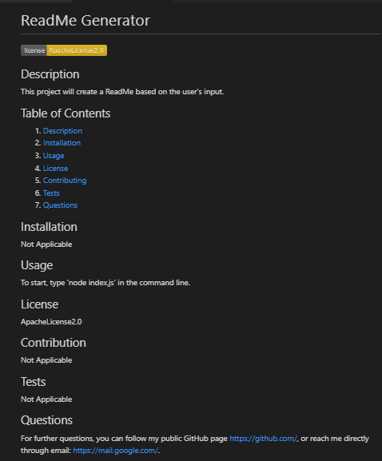

# readme-generator

Module 09: Node.js

## Table of Contents
1. [Description](#description)
2. [Visuals](#visuals)

## Description
This is a command-line application created to dynamically generate a professional README.md file from a user's input using the Inquirer package. 

[Link to live site](https://alyssa20lopez.github.io/readme-generator/)

## Visuals
Here is a visual of the front-end of the webpage design.

